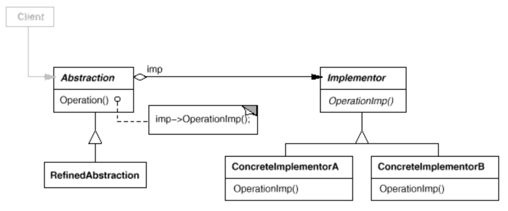

# Bridge Design Pattern

## Intent

Decouple an abstraction from its implementation so that the two can vary independently.

## Also Known As

Handle/Body

## Motivation

When an abstraction can have one of several possible implementations, the usual way to accomodate them is to use inheritance. An abstract class defines the interface to the abstraction, and concrete subclasses implement it in different ways. But this approach isn't always flexible enough. Inheritance binds an implementation to the abstraction permanently, which makes it difficult to modify, extend, and reuse abstractions and implementations independently.

**This basically means that this pattern was created to be used instead of inheritance in cases where you have different implementations for an specific class. Using inheritance, you would define a abstract class (an abstraction), and define a behavior for it creating a new class inheriting the abstraction (an implementor), with this, the implementation of the abstraction is permanently bound to a implementor. If you want to change the behavior of an abstraction, for example, you would need to create new implementor objects for it. Using this pattern, we can have different abstractions that can be combined with different implementors**

## Aplicability

Use the Bridge pattern when

- you want to avoid a permanent binding between an abstraction and its implementation. This might be the case, for example, when the implementation must be selected or switched at run-time.

    **Using inheritance, the actual behavior of an abstraction would be defined by a subclass, so when using it, you would need to use an instance of this subclass directly on your code. Using this pattern you can use just the the abstraction in your code, defining which implementation should be used in the constructor of your abstraction for example, so you client code would only depend of your abstraction. This part gets a little bit confusing when the author says "when the implementation must be selected or switched at run-time", because in my vision, you can select or switch implementations at run-time using inheritance too, the downside would be that your client code would need to depend of all implementation classes that could be used (that could be many), and when using a bridge you can also make your code dependent of all implementors (will be less classes than with inheritance), but you can also make it dependent of only the abstraction, making the abstraction responsible for defining its correct implementor**

- both the abstractions and their implementations should be extensible by
subclassing. In this case, the Bridge pattern lets you combine the different abstractions and implementations and extend them independently.

    **This is one of the main purposes of this pattern**

- changes in the implementation of an abstraction should have no impact on clients; that is, their code should not have to be recompiled.

- (C++) you want to hide the implementation of an abstraction completely from clients. In C++ the representation of a class is visible in the class interface.

- you have a proliferation of classes as shown earlier in the first Motivation diagram. Such a class hierarchy indicates the need for splitting an object into two parts. Rumbaugh uses the term "nested generalizations" [RBP+91] to refer to such class hierarchies.

- you want to share an implementation among multiple objects (perhaps using
reference counting), and this fact should be hidden from the client. A simple example is Coplien's String class [Cop92], in which multiple objects can share the same string representation (StringRep).

## Structure



## Participants

- Abstraction
  - defines the abstraction's interface.
  - maintains a reference to an object of type Implementor.

- RefinedAbstraction
  - Extends the interface defined by Abstraction.

- Implementor
  - defines the interface for implementation classes. This interface doesn't have to correspond exactly to Abstraction's interface; in fact the two interfaces can be quite different. Typically the Implementor interface provides only primitive operations, and Abstraction defines higher-level operations based on these primitives.

- Concretelmplementor
  - implements the Implementor interface and defines its concrete implementation.

## Consequences

The Bridge pattern has the following consequences:
  
1. *Decoupling interface and implementation*. An implementation is not bound permanently to an interface. The implementation of an abstraction can be configured at run-time. It's even possible for an object to change its implementation at run-time.

   Decoupling Abstraction and Implementor also eliminates compile-time dependencies on the implementation. Changing an implementation class doesn't require recompiling the Abstraction class and its clients. This property is essential when you must ensure binary compatibility between different versions of a class library. Furthermore, this decoupling encourages layering that can lead to a better structured system. The high-level part of a system only has to know about Abstraction and Implementor.

2. *Improved extensibility*. You can extend the Abstraction and Implementor hierarchies independently.

3. *Hiding implementation details from clients*. You can shield clients from implementation details, like the sharing of implementor objects and the accompanying reference count mechanism (if any).

## Implementation

Consider the following implementation issues when applying the Bridge pattern:

1. *Only one Implementor*. In situations where there's only one            implementation, creating an abstract Implementor class isn't necessary. This is a degenerate case of the Bridge pattern; there's a one-to-one relationship between Abstraction and Implementor. Nevertheless, this separation is still useful when a change in the implementation of a class must not affect its existing clients—that is, they shouldn't have to be recompiled, just relinked.

    Carolan [Car89] uses the term "Cheshire Cat" to describe this separation. In C++, the class interface of the Implementor class can be defined in a private header file that isn't provided to clients. This lets you hide an implementation of a class completely from its clients.

2. *Creating the right Implementor object*. How, when, and where do you decide which Implementor class to instantiate when there's more than one?

    If Abstraction knows about all Concretelmplementor classes, then it can instantiate one of them in its constructor; it can decide between them based on parameters passed to its constructor. If, for example, a collection class supports multiple implementations, the decision can be based on the size of the collection. A linked list implementation can be used for small collections and a hash table for larger ones.

    Another approach is to choose a default implementation initially and change it later according to usage. For example, if the collection grows bigger than a certain threshold, then it switches its implementation to one that's more appropriate for a large number of items.

    It's also possible to delegate the decision to another object altogether. In the Window/Windowlmp example, we can introduce a factory object (see Abstract Factory (87)) whose sole duty is to encapsulate platform-specifics. The factory knows what kind of Windowlmp object to create for the platform in use; a Window simply asks it for a Windowlmp, and it returns the right kind. A benefit of this approach is that Abstraction is not coupled directly to any of the Implementor classes.

3. *Sharing implementors*. Coplien illustrates how the Handle/Body idiom in C++ can be used to share implementations among several objects [Cop92]. The Body stores a reference count that the Handle class increments and decrements. The code for assigning handles with shared bodies has the following general form:

    ```
    Handle& Handle::operator= (const Handle& other) {
        other._body->Ref();
        _body->Unref();

        if (_body->RefCount() == 0) {
            delete _body;
        }
        _body = other._body;
        
        return *this;
    }
    ```

4. *Using multiple inheritance*. You can use multiple inheritance in C++ to combine an interface with its implementation [Mar91]. For example, a class can inherit publicly from Abstraction and privately from a Concretelmplementor. But because this approach relies on static inheritance, it binds an implementation permanently to its interface. Therefore you can't implement a true Bridge with multiple inheritance—at least not in C++.